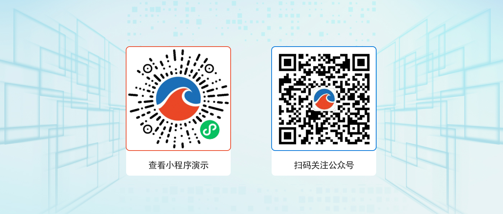
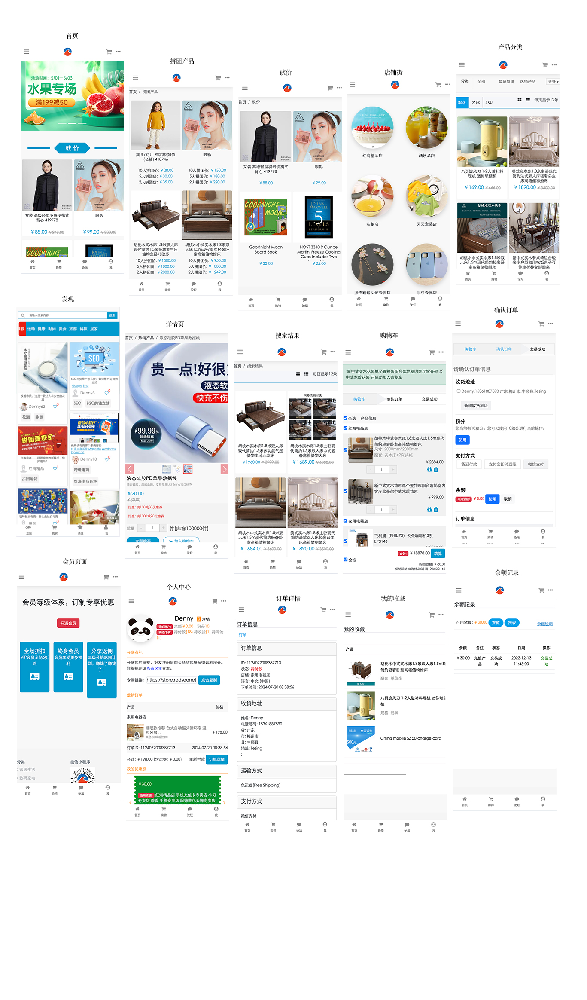

<div align="center" >
    
</div>
<div align="center">RedSeaNet Social e-commerce platform(PHP) Mobile APP </div>

<div align="center">

[Official Website](https://redseanet.com/) |
[Demo](http://store.redseanet/) |
[Help Document](https://redseanet.com/technology-sharing/ecomphp.html)

</div>

---

### Change Log

Click and See <a href="https://redseanet.com/technology-sharing/ecomphp/ecomphp_app_change_summary.html" target="_blank">Change Log</a>

---

### Install Local

Click and See <a href="https://github.com/RedSeaNet/RedSeaNet-Social-e-commerce-platform-mobile-app/blob/master/readme/install.md" target="_blank">Install Local</a>

---

### Introduce

RedSeaNet Social e-commerce platform(PHP) APP, bloggers post text, images or videos to promote products and stores; To use messages or comments connect customers and improve service. Based on React Native development, server repository: https://github.com/RedSeaNet/RedSeaNet-Social-e-commerce-platform-PHP.

---

### Highlight

```
1. Open source serve and APP, You can use all;
2. development with React Native;

```

### Demo



---

### Core Function

```

Function

```

RedSeaNet Social e-commerce platform function

```

Multiple payment methods: wechat Pay, Alipay;
Various types of goods: standard products, virtual products, charge card;
A variety of promotion: groups, bargain, coupons, reward points, recharge;
A variety of shipping method: express, distribution, self-pick, free mail, super freight template management, multiple self-pick points;
Flexible product attributes: can adapt to different products;
Product review/rating: Product review/rating;

```

Customer Management

```

Customer level: Customer level upgrade experience tasks;
Customer Group: Paying member Trial member benefits
Customer management: Customer Type Add Customer Label/Group User operation Browsing history
Login: wechat login mobile phone number quick login and account password login

```

CMS Management

```

Pages
Pages Management
Pages categories Management
Pages List
Content blocks Management

```

Sales

```

Shopping Cart
Orders
Bills
Shipping
Refund Orders
Order Status

```

Social Forum

```

Posts（Text,Images,Videos）
Tags
Review/Comments
Follow
Recomment Products

```

---

### UI



---

Welcome <a href="https://github.com/RedSeaNet/RedSeaNet-Social-e-commerce-platform-mobile-app/issues" target="_blank">Feedback Issue</a>

Welcome <a href="https://github.com/RedSeaNet/RedSeaNet-Social-e-commerce-platform-mobile-app" target="_blank">Contribution</a>

---

## How to contribute

Fork the repository,, edit and [submit a pull request](https://github.com/RedSeaNet/RedSeaNet-Social-e-commerce-platform-mobile-app/pulls).

Please be very clear on your commit messages and pull request, empty pull request messages may be rejected without reason.

---

## Contact Us

Email： [info@redseanet.com](info@redseanet.com)

Wechat：


(≧∀≦)ゞ Our team can support the platform's custom development services(≧∀≦)ゞ。

---

### Copyright

The Apache License 2.0 license includes:

1. License: Allow anyone to use, copy, modify and distribute the software for any purpose.

2. Copyright Notice: The original copyright notice and license notice are required to be included in the software and related documentation.

3. Disclaimer of Warranties: Indicates that the Software is provided as IS, without any express or implied warranties or warranTIES. The author is not liable for any damages.

4. Contributor License: Requires all contributors to grant a perpetual, royalty-free, irrevocable license to the Apache Software Foundation to use, copy, modify, and distribute their contributions.

5. Patent License: In order to protect users of the software, this license requires contributors to grant any necessary patent licenses in order to use it for Apache Software Foundation projects.

Apache License 2.0 is a open source license that allows people to freely use, modify, and distribute software.

---

### Copyright Information

The copyright information of third-party source code and binary files contained in this project is marked separately.

All rights reserved Copyright © 2019-2024 RedSeaNet INC. (https://redseanet.com)

All rights reserved.

The copyright holder is Shenzhen RedSeaNet Internet Technology Co., LTD.

---

```

```
